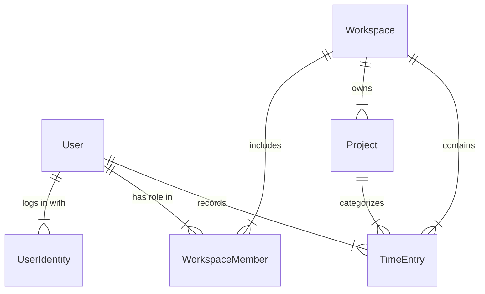

# Multitenant Architecture Plan (Control Horario)

This document outlines the phased evolution of the platform's multi-tenant architecture, ensuring both early simplicity and future flexibility.

## Concepts
- **User (Usuario):** The individual human registering their time.
- **Company/Workspace (Empresa/Espacio):** The organizational unit that groups users, projects, and time entries.
- **Identity (Identidad/Email):** The access credentials. A user can have multiple emails (personal, corporate A, corporate B) linked to a single main account.

---

## Phase 1: Simple Linking (Current/Initial State)
*Goal: Fast go-to-market. Keep the schema simple while supporting freelancers and single-company teams.*

- A `Workspace` represents either a Company or a Freelancer's personal space.
- A `User` is directly bound to **one** `Workspace` (`workspace_id` in the `User` model).
- A `User` has exactly **one** email address for login.
- **Limitation:** If "Eloi" works for two companies, Eloi needs two separate accounts with two different emails.

---

## Phase 2: Many-to-Many Workspaces
*Goal: Allow users to switch between companies without logging out.*

We break the direct link between `User` and `Workspace` and introduce a pivot table (o modelo intermedio).

**Schema Changes:**
1. **Remove** `workspace_id` from the `User` model.
2. **Create** `WorkspaceMember` model:
   - `user_id`
   - `workspace_id`
   - `role` (e.g., admin, employee)
3. **TimeEntries & Projects** continue to belong to a `Workspace`, but now ensure the logging user is an active `WorkspaceMember`.
4. **Login Flow:** The user logs in and the frontend presents a "Workspace Selector" (similar to Slack or Notion).

**Benefit:** A user accesses all their work via a single account and email.

---

## Phase 3: Multiple Identities (Unified Account)
*Goal: Solve the "Personal vs Corporate Mail" problem.*

A user wants to manage their personal tracker (Personal Workspace) using `eloi@gmail.com` and their agency tracker using `eloi@company.com`, but see everything in one unified dashboard.

**Schema Changes:**
1. **Remove** `email` and `password` from the core `User` profile.
2. **Create** `UserIdentity` (or `UserEmail`) model:
   - `user_id`
   - `email`
   - `password`
   - `is_primary` (boolean)
   - `verified` (boolean)
3. **Login Flow:** 
   - User signs in with `eloi@gmail.com`. The system finds the `UserIdentity`, links it to User ID `#123`.
   - User signs in with `eloi@company.com`. The system finds another `UserIdentity`, also linked to User ID `#123`.
   - In both cases, the user logs into the exact same account and sees the same Workspaces.

### Summary of the Final Vision (Phase 3)

## Next Steps
For now, we will stick to **Phase 1** as implemented in `api/models/` to ensure we can build the core time-tracking features quickly. Once the core value is proven, we will migrate to **Phase 2** using ElioApi's `SchemaSyncer` to automatically handle the database alterations.
